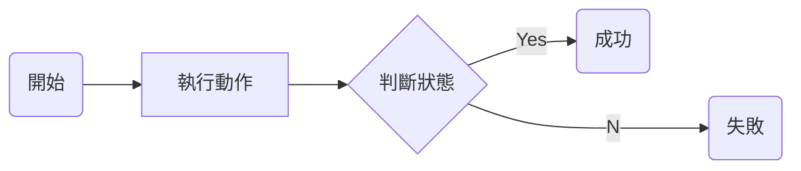
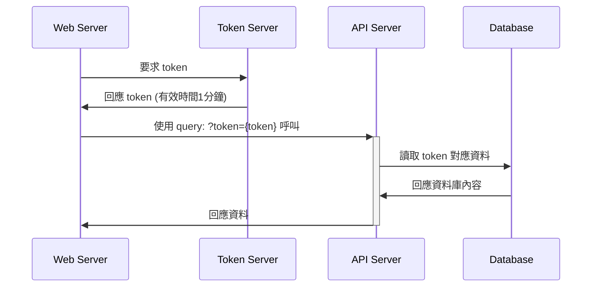
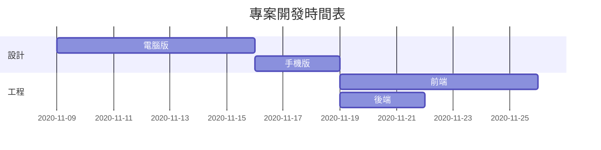

# 開發圖

    練習

```mermaid
graph LR
A(開始)
B[執行動作]
C{判斷狀態}
D(成功)
E(失敗)
A-->B
B-->C
C-->|Yes|D
C--No-->E
```

```mermaid
sequenceDiagram
participant A as Web Server
participant B as Token Server
participant C as API Server
participant D as Database

A ->> B: 要求 token
B ->> A: 回應 token (有效時間1分鐘)
A ->>+ C: 使用 query: ?token={token} 呼叫
C ->> D: 讀取 token 對應資料
D ->> C: 回應資料庫內容
C ->>- A: 回應資料 
```

```mermaid
gantt
title 專案開發時間表
section 設計
電腦版: d1, 2020-11-9, 7d
手機版: d2, after d1, 3d
section 工程
前端: after d2, 7d
後端: after d2, 3d
```